

# OpenCart Extension Bundle

**13 free, open-source extensions for OpenCart 2.3.x & 3.x — checkout, SEO, marketing, notifications and performance, all in one place.**

### ⭐ If this bundle saves you time, please [star the repo](https://github.com/AlexWaha/opencart-bundle) — it helps other OpenCart store owners find it.

---

## Overview

**OpenCart Extension Bundle** is a free and open-source collection of extensions for the OpenCart e-commerce CMS. Every extension is compatible with **OpenCart 2.3.x and 3.x** (4.x* partial), ships as a ready-to-install `*.ocmod.zip`, and comes with English and Russian docs. Provided **as is**, without warranty.

All modules share a small helper library (**AW Core**) and a consistent admin UI, so they look and behave the same across your store.

## Installation

1. Install **[aw_core_oc2.3-3.x.ocmod.zip](https://github.com/AlexWaha/opencart-bundle/blob/master/Core/dist/aw_core_oc2.3_3.x.ocmod.zip)** first — shared helper functionality required by all extensions.
2. Install any extension's `*.ocmod.zip` from its **`dist/`** folder (links in the table below).
3. For step-by-step setup, see the **`docs/en.md`** / **`docs/ru.md`** inside each extension folder.

> Always back up your store before installing extensions on production.

---

## Available extensions

| | Extension | What it does | Get it |
|:---:|---|---|---|
|  | **[Easy Checkout](easy-checkout)** ⭐ | One-page checkout with a drag-and-drop page builder, custom fields, and shipping/payment control. | [Download](https://github.com/AlexWaha/opencart-bundle/blob/master/easy-checkout/dist/aw_easy_checkout_oc2.3-3.x.ocmod.zip) · [Docs](easy-checkout/docs/en.md) |
|  | **[SMS Notifications](sms-notifications)** ⭐ | Order status SMS + Telegram alerts, OTP login, 30+ SMS gateways. | [Download](https://github.com/AlexWaha/opencart-bundle/tree/master/sms-notifications/dist/aw_sms_notify_oc2.3-3.x.ocmod.zip) · [Docs](sms-notifications/docs/en.md) |
|  | **[XML Feed](xml-feed)** ⭐ | Product feeds for Google Merchant, Facebook and any marketplace. | [Download](https://github.com/AlexWaha/opencart-bundle/blob/master/xml-feed/dist/aw_xml_feed_oc2.3-3.x.ocmod.zip) · [Docs](xml-feed/docs/en.md) |
|  | **[E-commerce Tracking (GA4)](ecommerce-tracking)** ⭐ | Full GA4 e-commerce event tracking via OpenCart events. | [Download](https://github.com/AlexWaha/opencart-bundle/blob/master/ecommerce-tracking/dist/aw_ecommerce_tracking_oc2.3-3.x.ocmod.zip) · [Docs](ecommerce-tracking/docs/en.md) |
|  | **[Landing Pages](landing-pages)** | Build custom landing pages and short marketing links. | [Download](https://github.com/AlexWaha/opencart-bundle/blob/master/landing-pages/dist/aw_landing_pages_oc2.3-3.x.ocmod.zip) · [Docs](landing-pages/docs/en.md) |
|  | **[Age Verification](age-verification)** | Age-gate popup shown before customers enter the store. | [Download](https://github.com/AlexWaha/opencart-bundle/blob/master/age-verification/dist/aw_age_verification_oc2.3-3.x.ocmod.zip) · [Docs](age-verification/docs/en.md) |
|  | **[Alcohol Dilution Calculator](moonshine-calc)** | Interactive alcohol/moonshine dilution calculator page. | [Download](https://github.com/AlexWaha/opencart-bundle/blob/master/moonshine-calc/dist/aw_moonshine_calculator_oc2.3-3.x.ocmod.zip) · [Docs](moonshine-calc/docs/en.md) |
|  | **[Global Layout](global-layout)** | Inject site-wide HTML/CSS/JS and layout tweaks from the admin. | [Download](https://github.com/AlexWaha/opencart-bundle/blob/master/global-layout/dist/aw_global_layout_oc2.3-3x.ocmod.zip) · [Docs](global-layout/docs/en.md) |
| 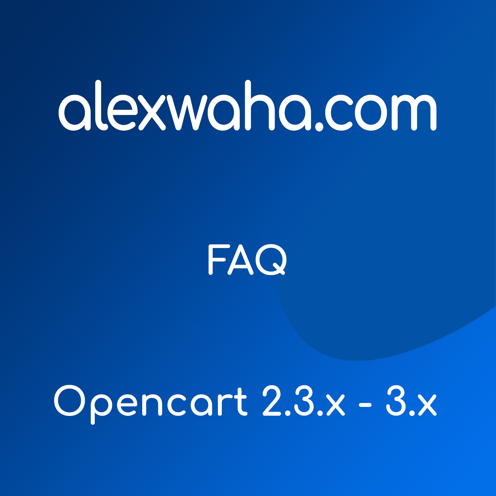 | **[FAQ](faq)** | Frequently Asked Questions blocks for products and pages. | [Download](https://github.com/AlexWaha/opencart-bundle/blob/master/faq/dist/aw_faq_oc2.3-3.x.ocmod.zip) · [Docs](faq/docs/en.md) |
|  | **[Store Reviews](store-reviews)** | Customer store reviews with a configurable carousel. | [Download](https://github.com/AlexWaha/opencart-bundle/blob/master/store-reviews/dist/aw_store_reviews_oc2.3-3.x.ocmod.zip) · [Docs](store-reviews/docs/en.md) |
|  | **[Buyer History](buyer-history)** | Customer order history and duplicate-order flags in the order list. | [Download](https://github.com/AlexWaha/opencart-bundle/blob/master/buyer-history/dist/aw_buyer_history_oc2.3-3.x.ocmod.zip) · [Docs](buyer-history/docs/en.md) |
|  | **[Microdata](microdata)** | Schema.org microdata for rich search-result snippets. | [Download](https://github.com/AlexWaha/opencart-bundle/blob/master/microdata/dist/aw_microdata_oc2.3-3.x.ocmod.zip) · [Docs](microdata/docs/en.md) |
| 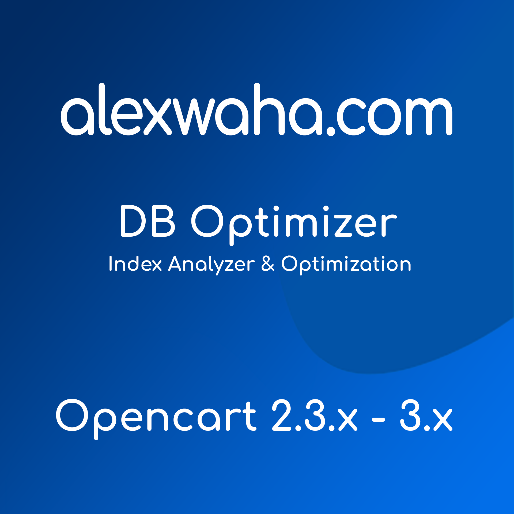 | **[DB Optimizer](db-optimizer)** | Analyze the database, add missing indexes and convert tables to InnoDB — safely and reversibly. | [Download](https://github.com/AlexWaha/opencart-bundle/blob/master/db-optimizer/dist/aw_db_optimize_oc2.3-3.x.ocmod.zip) · [Docs](db-optimizer/docs/en.md) |

> ⭐ = featured. More extensions are on the way (30+ planned).

---

## Screenshots

Captured on a live OpenCart 3.x demo store with a real 3,000-product catalog.

<table>
  <tr>
    <td width="50%"><b>DB Optimizer</b> 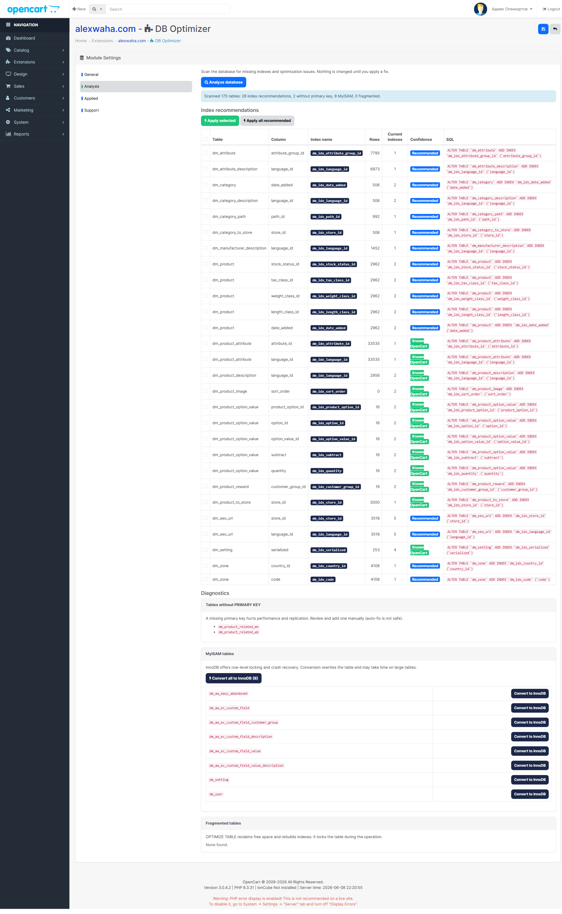</td>
    <td width="50%"><b>Easy Checkout (page builder)</b> 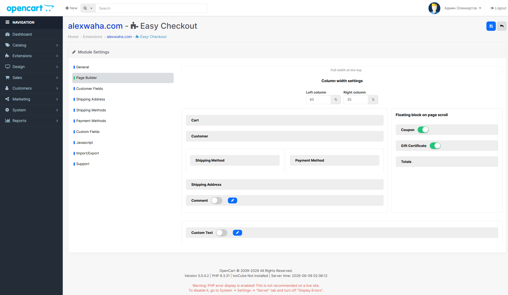</td>
  </tr>
  <tr>
    <td><b>Store Reviews</b> 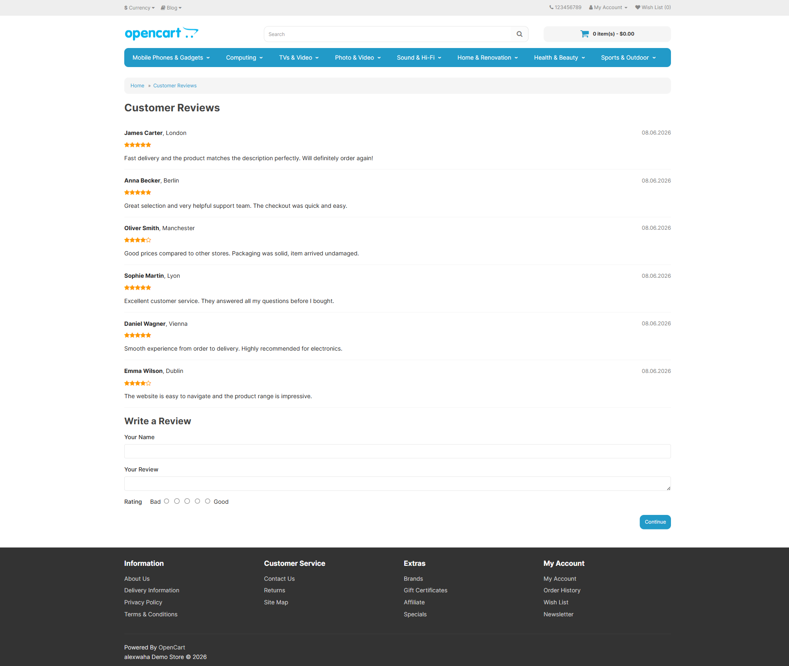</td>
    <td><b>FAQ</b> 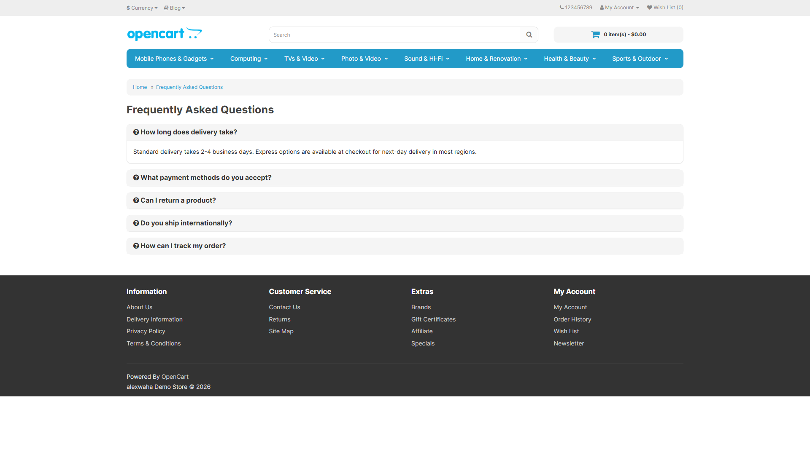</td>
  </tr>
  <tr>
    <td><b>Age Verification</b> 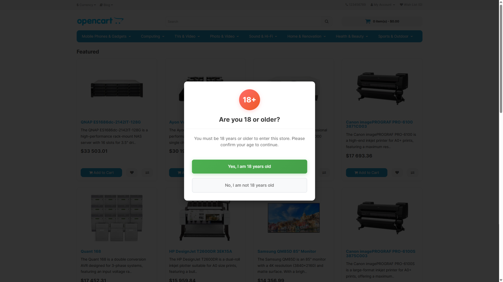</td>
    <td><b>Alcohol Dilution Calculator</b> 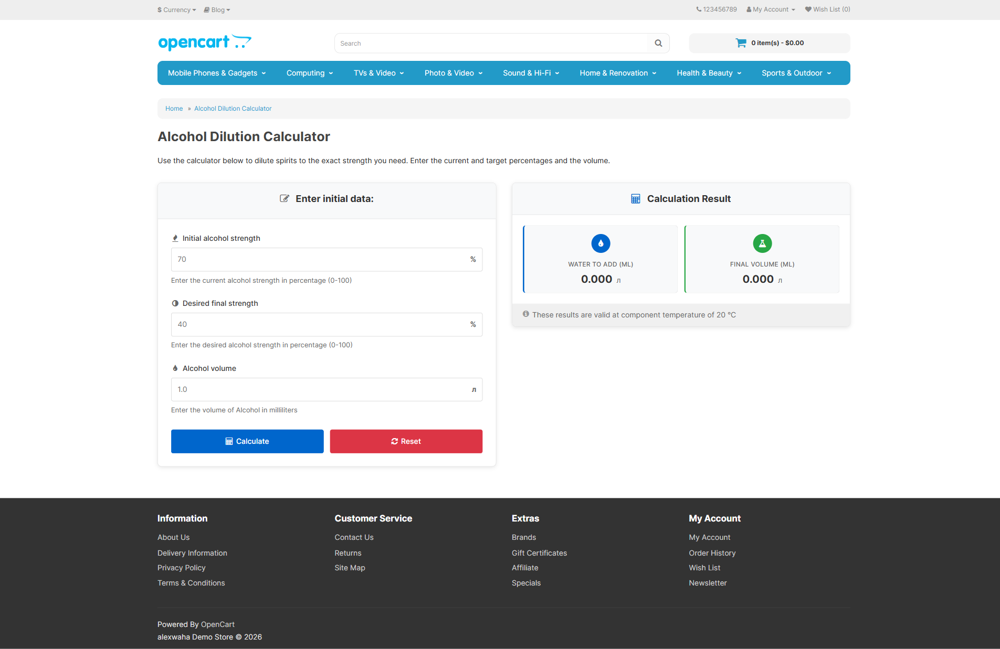</td>
  </tr>
  <tr>
    <td><b>E-commerce Tracking (GA4)</b> 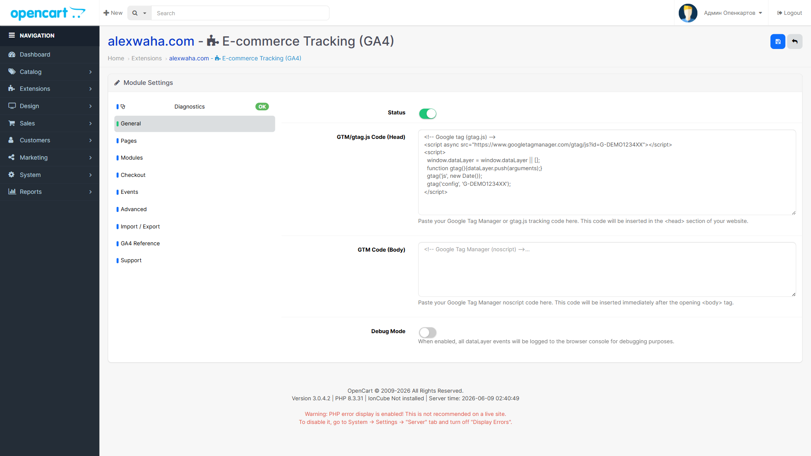</td>
    <td><b>SMS Notifications</b> 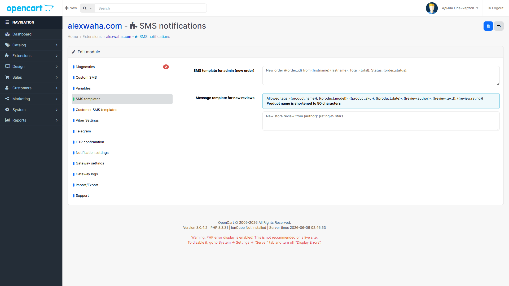</td>
  </tr>
  <tr>
    <td><b>Microdata</b> 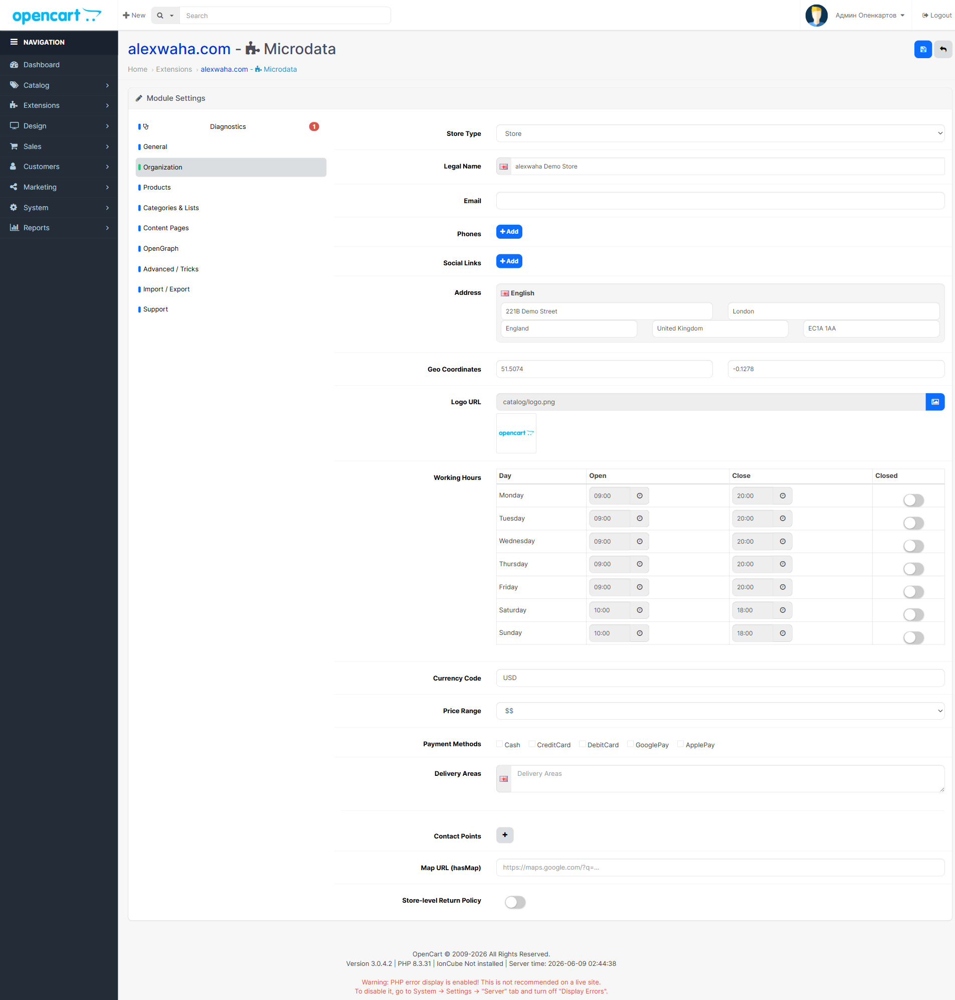</td>
    <td><b>Buyer History</b> 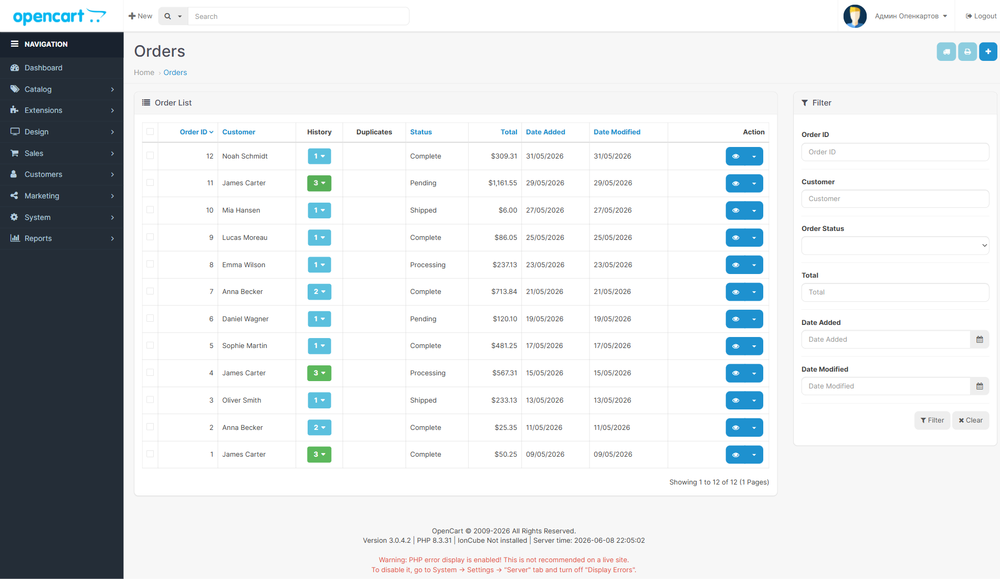</td>
  </tr>
</table>

---

## Compatibility

| OpenCart | Status |
|---|---|
| 2.3.x | ✅ Fully supported |
| 3.x | ✅ Fully supported |
| 4.x | ⚠️ Partial — not all extensions are compatible yet |

---

## Reporting Issues

Before submitting a bug report, please:

1. **Search existing issues** — check open and closed [issues](https://github.com/AlexWaha/opencart-bundle/issues).
2. **Open a bug report** via [GitHub Issues](https://github.com/AlexWaha/opencart-bundle/issues/new/choose).
3. **Contact directly** via [Telegram](https://t.me/alexwaha_dev) if needed.
4. **Core-related issues** with OpenCart itself should be reported upstream.
5. **Check your environment** — make sure the issue is not caused by your hosting.

> **Important**
> - Not all extensions are compatible with the latest OpenCart 4.x.
> - Report only bugs related to the extension code; otherwise the issue may be closed.
> - Provide exact reproduction steps, error logs and screenshots when possible.
> - Never post sensitive data (logins, passwords, host details) publicly.

---

## Contributing

Contributions, bug reports and feature requests are welcome. See **[CONTRIBUTING.md](.github/CONTRIBUTING.md)** and the issue templates. If you find the bundle useful, the simplest way to help is to **⭐ star the repository**.

## License

Licensed under the [GNU General Public License v3 (GPLv3)](LICENSE).

---

## About the Developer

Alex Vakhovski — Software Engineer with over a decade of full-stack experience and strong e-commerce expertise. I build scalable, high-performance applications and deliver robust, stable architecture that drives operational efficiency and revenue.

Learn more on my [website](https://alexwaha.com) and connect on [LinkedIn](https://www.linkedin.com/in/alexwaha).

## Useful Links

